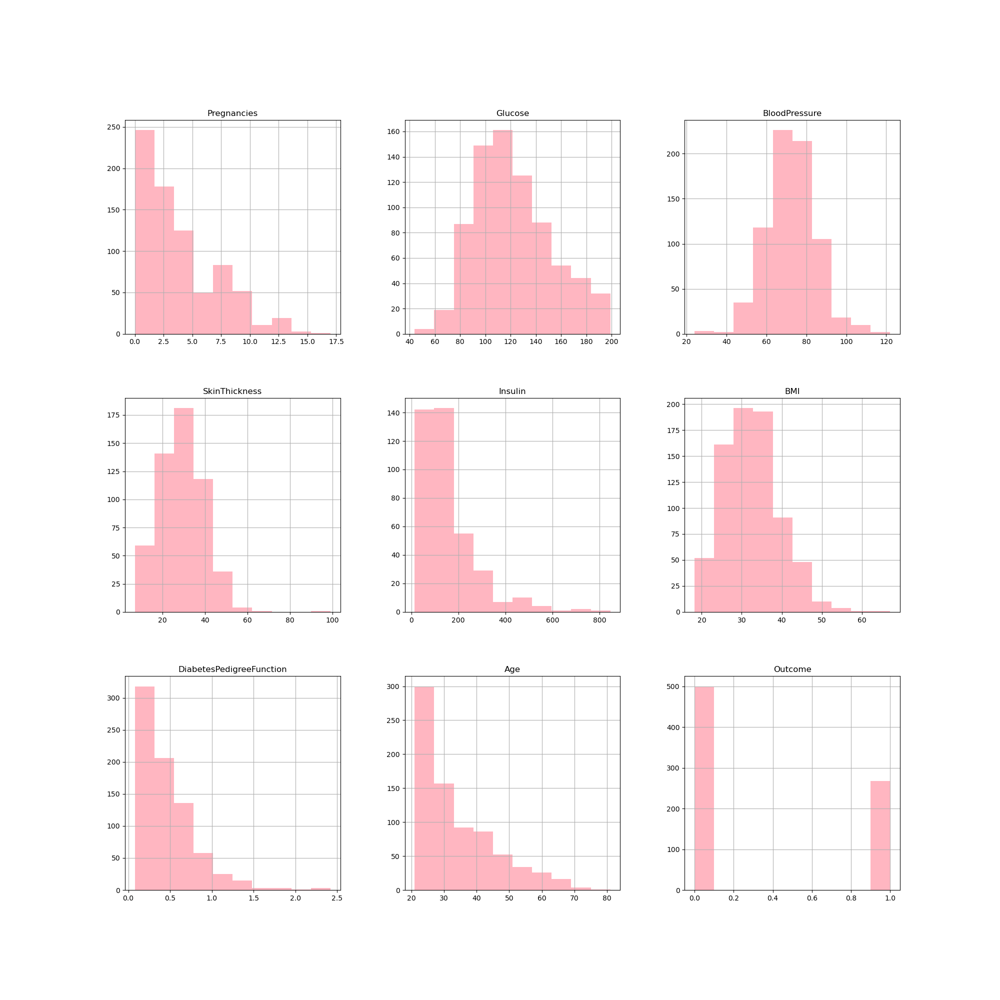
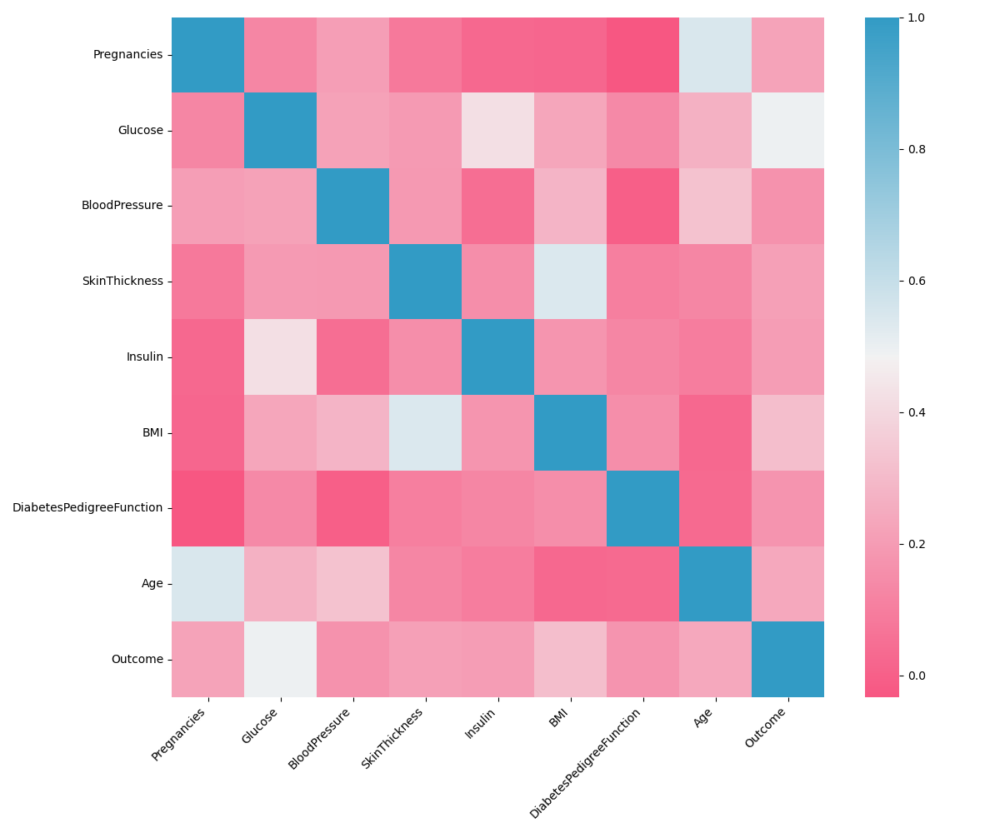
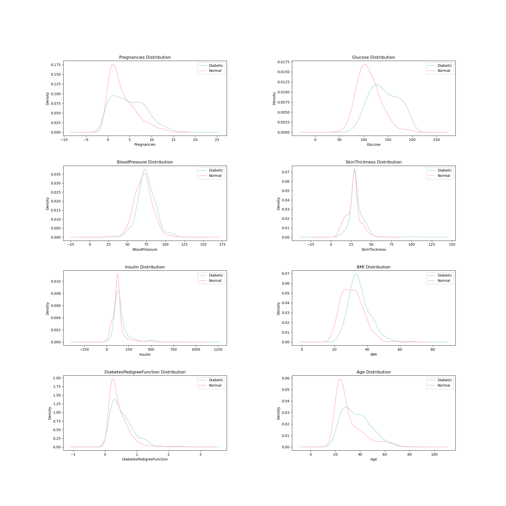
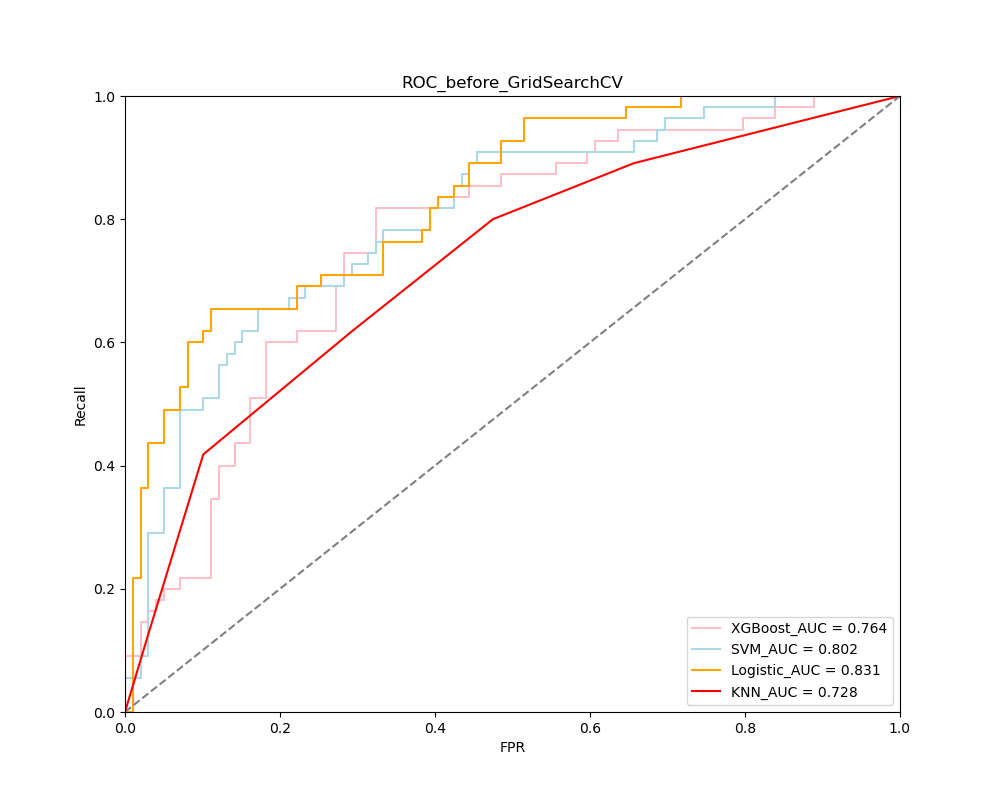

# Early-Detection-of-Diabetes

This project provides a front-end interface for a early detection tool for diabetes, enabling users to enter there personal health imformation and the tool then determines if the user is at risk of developing diabetes based on the information entered by the user. Built with Python, Tkinter, and scikit-learn.KNN, Logistic Regression, SVM and XGBoost were used in the project for diabetes detection. In addition to this the project provides python files for data preprocessing, visualization and model training processes.

## Table of Contents
- [Project Structure](#project-structure)
- [Dependencies](#dependencies)
- [Installation](#installation)
- [Usage](#usage)
- [Technical Details](#technical-details)
- [Commands](#commands)


## Project Structure
```
.
├── Data Cleaning           # Handles video display and controls
├── Data Visualization     # Main GUI application, handles video selection, processing steps, and playback
├── Model Training        # Main GUI application, handles video selection, processing steps, and playback 
└── User Interface           # Command execution in a separate thread to avoid UI blocking
```

## Dependencies
- **Python 3.x**
- **Tkinter**: GUI framework (included in standard Python libraries).
- **Scikit-Learn**: Machine Learning Package.
- **Matplotlib**: Visualization.
- **Seaborn**: Visualization.


Install dependencies using:
```bash
pip install Tinter Scikit-Learn Matplotlib Seaborn
```

## Installation
1. Clone the repository:
   ```bash
   git clone https://github.com/KouHaoxuan/Early-Detection-of-Diabetes
   cd Early-Detection-of-Diabetes
   ```
2. Install the required packages (listed above).

## Usage
1. **Run the Application**:
   ```bash
   User.py
   ```
2. **Enter Personal Health Data**: Enter personal information line by line
3. **Select Model**: Select the model you want to use
3. **Prediction**: Click the predict button
4. **Diagnosis**: The diagnostic results are displayed in a pop-up window

## Technical Details
### Data Preprocessing Steps
- **Step 1**: Prepares the environment.
- **Step 2**: Data Preprocessing.
  ```python
  python clean.py
  ```
- **Step 3**: Model Training.
  ```python
  python KNN_build.py
  python Log_build.py
  python SVM_build.py
  python XGBoost_build.py
  ```
- **Step 4**: Runs the User Interface.
  ```python
  python User.py
  ```

## Results






### The project used the following datasets:

```
https://www.kaggle.com/datasets/uciml/pima-indians-diabetes-database/data
```
